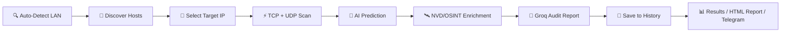

<div align="center">

# 🛰️ Smart Network Mapper

### _Next-Generation Network Diagnostic & AI-Powered Security Suite_

<p>
  
  
  
  
  
</p>

<p>
  
  
  
  
  
  
  
  
</p>

<br/>

**A premium cyberpunk-styled network scanner combining industrial-grade analysis with an immersive user interface, AI-powered vulnerability prediction, real-time CVE intelligence, and Telegram automation.**

<br/>

[Features](#-key-features) •
[Architecture](#%EF%B8%8F-project-architecture) •
[Installation](#%EF%B8%8F-installation) •
[Usage](#-usage) •
[AI Engine](#-ai-engine) •
[Automation](#-telegram-bot--n8n-automation) •
[Build & Deploy](#-build--deploy) •
[License](#-license)

<br/>

</div>

---

## 🌟 Why Smart Network Mapper?

> _"Not just a scanner. A complete AI-driven network diagnostic and threat intelligence suite."_

**Smart Network Mapper (SNM)** combines the **analysis power** of professional cybersecurity tools with a **modern user experience**, **predictive intelligence**, **real-time CVE enrichment**, and **generative AI reporting** capable of evaluating the threat level of every service detected on a network — instantly and intelligibly.

<table>
<tr>
<td width="50%">

### 🎯 Who is it for?

- 🔐 **Pentesters** & security auditors
- 👨‍💻 **Network administrators**
- 🎓 **Cybersecurity students**
- 🛡️ **SOC analysts** & IT professionals

</td>
<td width="50%">

### ⚡ Why choose SNM?

- 🚀 **Multi-threaded** scanning (up to 300 workers)
- 🧠 **Hybrid ML + NVD** vulnerability detection
- 🤖 **AI-generated** audit reports (Groq Llama-3.3-70b)
- 📲 **Telegram bot** automation via n8n
- 🎨 **Cyberpunk premium** interface
- 📦 **Portable Windows EXE** (no install needed)

</td>
</tr>
</table>

---

## ✨ Key Features

### 🔍 Discovery & Mapping

| Feature                        | Description                                                                         |
| ------------------------------ | ----------------------------------------------------------------------------------- |
| 🌐 **Auto LAN Detection**      | Automatic identification of the network config (Wi-Fi/Ethernet) via `psutil`        |
| 📡 **Multi-threaded TCP Ping** | Fast host discovery across the subnet using `ThreadPoolExecutor` (200 workers)      |
| 🖥️ **OS Fingerprinting**       | Passive OS estimation via TTL analysis (≤64 Linux, ≤128 Windows, ≤255 network gear) |
| 🏷️ **Device Information**      | MAC address (ARP), reverse DNS hostname & metadata retrieval for each device        |

### 🛡️ Security Analysis

| Feature                           | Description                                                                            |
| --------------------------------- | -------------------------------------------------------------------------------------- |
| ⚡ **Multi-Mode TCP Scanning**    | **Fast** (22 critical ports), **Full** (1–65535) or **Custom** modes, 300 workers      |
| 📶 **UDP Scanning**               | 10 critical UDP ports: DNS, DHCP, TFTP, NTP, SNMP, IKE/VPN, Syslog, UPnP               |
| 🎯 **Banner Grabbing**            | Specialized probes for **HTTP, SSH, FTP, SMTP, POP3, IMAP, Redis, MySQL**              |
| 🔬 **Service Versioning**         | Precise service signature & version extraction                                         |
| 🧠 **AI Vulnerability Predictor** | Random Forest classifier (500 trees) trained on **2.3M** NVD/NIST entries              |
| 🧩 **Wisdom Layer**               | Post-AI heuristic layer overriding known-safe / known-vulnerable edge cases            |
| 🛰️ **OSINT NVD Enrichment**       | Real-time lookup of official CVEs (NVD/NIST API) — hybrid ML + deterministic detection |

### 📊 Reporting, Export & History

| Feature                    | Description                                                                |
| -------------------------- | -------------------------------------------------------------------------- |
| 🎨 **Premium HTML Report** | Responsive design with cyberpunk SVG donut charts                          |
| 🤖 **AI Audit Report**     | Professional security audit generated by **Groq Llama-3.3-70b**            |
| 📦 **JSON Export**         | Structured data ready for integration                                      |
| 📈 **Real-Time Dashboard** | Live visualization of security score and critical ports                    |
| 💾 **SQLite Scan History** | All scans saved locally (WAL mode); reload, compare or delete past results |

### 📲 Automation

| Feature                        | Description                                                                |
| ------------------------------ | -------------------------------------------------------------------------- |
| 🤖 **Telegram Bot**            | Trigger scans and receive full reports directly from a smartphone          |
| 🔁 **n8n Workflow**            | 12-node workflow orchestrating discovery → scan → AI report → delivery     |
| ✂️ **Smart Message Splitting** | Automatic chunking of AI reports exceeding Telegram's 4096-character limit |

---

## 🏗️ Project Architecture

> 📐 **UML Diagrams** (Use Case, Class & Sequence Diagrams): available in [`/docs`](https://github.com/Amine-NAHLI/smart-network-mapper/tree/main/docs)

```
smart-network-mapper/
│
├── 📄 app.py                          # 🎨 GUI Orchestrator (~200 lines, post-refactor)
├── 📄 launcher.py                     # 🚀 Entry point (UAC elevation → model check → app)
├── 📄 snm_paths.py                    # 📍 Cross-platform path management (dev vs frozen)
├── 📄 snm_env.py                      # 🔑 Centralized .env loader (GROQ_API_KEY, TELEGRAM_BOT_TOKEN)
├── 📄 test_groq.py                    # 🧪 Standalone Groq API connectivity/debug script
├── 📄 INSTALL_WINDOWS.txt             # 📋 Windows installation notes
├── 📄 .env.example                    # 🔐 Environment variables template
├── 📄 requirements.txt                # 📦 Python dependencies
├── 📄 LICENSE                         # 📜 MIT License
│
├── 📁 docs/                           # 📐 UML Diagrams (Use Case, Class, Sequence)
│
├── 📁 gui/                            # 🖥️ Modular GUI Package
│   ├── constants.py                   # ├─ Design-system tokens (colors, fonts, critical ports)
│   ├── db.py                          # ├─ SQLite database manager (scan history, WAL mode)
│   └── 📁 pages/                      # └─ Individual page modules
│       ├── dashboard.py               #     ├─ Overview: stats cards, pie chart
│       ├── new_scan.py                #     ├─ 3-step workflow: config → discovery → scan + AI
│       ├── results.py                 #     ├─ Filterable results table, JSON export, HTML report
│       ├── history.py                 #     ├─ Persistent scan history (Load / Delete / Clear All)
│       └── about.py                   #     └─ Animated cyberpunk about page
│
├── 📁 scanner/                        # 🔬 Core Scanning Engine
│   ├── host_discovery.py              # ├─ Multi-threaded TCP Ping host discovery
│   ├── port_scanner.py                # ├─ Multi-threaded TCP + UDP scanning, banner grabbing
│   ├── device_info.py                 # ├─ MAC (ARP), reverse DNS hostname, OS via TTL
│   ├── osint_enricher.py              # ├─ Real-time CVE enrichment via NVD/NIST API
│   └── utils.py                       # └─ LAN auto-detection, CIDR validation, is_public_ip()
│
├── 📁 model/                          # 🧠 AI Vulnerability Engine
│   ├── predictor.py                   # ├─ Inference pipeline (Random Forest) + Wisdom Layer
│   ├── model_download.py              # ├─ Hugging Face model fetcher
│   ├── model_downloader_gui.py        # ├─ GUI for first-launch model download (progress bar)
│   ├── download_models.py             # ├─ CLI model download script
│   ├── vulnerability_model.pkl        # ├─ Main RF classifier — 500 trees, depth 25 (~5.1 GB)
│   ├── quantile_transformer.pkl       # ├─ Version normalization (24 KB)
│   ├── scaler.pkl                     # ├─ Feature scaling — RobustScaler (895 B)
│   └── feature_names.pkl              # └─ Ordered list of 91 expected features (1.5 KB)
│
├── 📁 reporter/                       # 📊 Report Generation
│   ├── html_generator.py              # ├─ Premium cyberpunk HTML reports with SVG charts
│   ├── ai_generator.py                # ├─ AI audit report via Groq (Llama-3.3-70b), SSL enforced
│   └── telegram_utils.py              # └─ Smart message splitting (> 4096 chars) for Telegram
│
├── 📁 workflow/                       # 🔁 Automation
│   └── My workflow SNM.json           # └─ n8n workflow export (12 nodes — Telegram bot)
│
├── 📁 build_tools/                    # 🔧 Build & Release Pipeline
│   ├── build.bat                      # ├─ PyInstaller compilation script
│   ├── build.spec                     # ├─ PyInstaller spec file (.pkl models excluded)
│   ├── package_release.bat            # ├─ Portable package creator
│   ├── upload_windows_release.py      # ├─ Hugging Face ZIP uploader
│   └── pyi_rth_snm_stdio.py          # └─ PyInstaller runtime hook (stdout/stderr fix)
│
├── 📁 cli/                            # ⌨️ Command-Line Interface
│   └── run_scan.py                    # └─ --discover / --target <IP> / --mode fast|full
│
├── 📁 assets/                         # 🎨 Visual Resources
├── 📁 build/  · 📁 dist/  · 📁 release/  # 📦 PyInstaller build artifacts
│
├── 📁 outputs/                        # 💾 Generated Reports & SQLite DB
│   ├── scan_result.json               # ├─ Latest scan data
│   ├── report.html                    # ├─ Latest HTML report
│   └── history.db                     # └─ SQLite scan history database (WAL)
│
└── 📁 tests/                          # 🧪 Test Suite (37 tests — 0 failures)
    ├── test_utils.py                  # ├─ CIDR validation, parse_subnet, is_public_ip
    ├── test_host_discovery.py         # ├─ TCP Ping, scan_subnet (mocked)
    ├── test_port_scanner.py           # ├─ TCP/UDP scan, callbacks, sorting
    ├── test_osint_enricher.py         # ├─ NVD CVE enrichment (mocked API)
    ├── test_ai_generator.py           # ├─ Groq report generation, SSL, User-Agent (mocked API)
    └── test_model_reliability.py      # └─ 18 known-version reliability cases (≥ 90% accuracy)
```

---

## 🛠️ Installation

### 📋 Prerequisites

<table>
<tr>
<td>

**🐍 Python**

- Version **3.8+** required
- pip up-to-date recommended

</td>
<td>

**🔐 Privileges**

- **Admin/Root** required for raw sockets & ARP
- User mode: limited features

</td>
<td>

**📡 Network Library**

- **Windows** : [Npcap](https://npcap.com/) required
- **Linux/Mac** : native libpcap

</td>
</tr>
</table>

### 🚀 Quick Setup (From Source)

```bash
# 1. Clone the repository
git clone https://github.com/Amine-NAHLI/smart-network-mapper.git
cd smart-network-mapper

# 2. Create a virtual environment (recommended)
python -m venv .venv
.venv\Scripts\activate        # Windows
# source .venv/bin/activate   # Linux/macOS

# 3. Install dependencies
pip install -r requirements.txt

# 4. Configure environment variables
cp .env.example .env
# Edit .env and add your GROQ_API_KEY and TELEGRAM_BOT_TOKEN

# 5. Download AI models (~5.1 GB from Hugging Face)
python model\download_models.py

# 6. Verify installation
python -c "import scapy, customtkinter, sklearn, huggingface_hub; print('✅ All systems ready!')"
```

### 📦 Portable Windows Installer (No Python Required)

Download the pre-built portable version from the documentation site:

1. Download `SNM_Windows_Portable_Complet.zip` from [the documentation](https://amine-nahli.github.io/snm-docs/)
2. Extract the ZIP
3. Run `SNM.exe` (accept the UAC admin prompt)
4. On first launch, the app automatically downloads the AI models from Hugging Face

> ⚠️ **Windows Note**: If you get a Scapy error, install [Npcap](https://npcap.com/#download) and check _"Install Npcap in WinPcap API-compatible Mode"_.

---

## 🚀 Usage

### 🎨 Graphical Mode (GUI) — _Recommended_

The full interface with real-time dashboard and cyberpunk visualizations:

```bash
python app.py
```

> 💡 **Run as admin** to unlock all raw-socket/ARP features:
>
> - **Windows**: Right-click terminal → _Run as Administrator_
> - **Linux/Mac**: `sudo python app.py`

### ⌨️ Command-Line Mode (CLI)

Ideal for servers, scripting, or n8n automation:

```bash
# Discover active hosts on the local network
python cli/run_scan.py --discover

# Fast scan (22 TCP + 10 UDP ports, ML prediction, NVD enrichment, Groq report)
python cli/run_scan.py --target 192.168.1.1 --mode fast

# Full scan (1–65535 TCP ports + UDP, full report)
python cli/run_scan.py --target 192.168.1.1 --mode full
```

The script automatically loads `.env` at startup (`GROQ_API_KEY`, `TELEGRAM_BOT_TOKEN`) and generates `outputs/scan_result.json` and `outputs/report.html`.

### 📖 Typical Workflow



**GUI Steps:**

1. Click **"Auto Detect"** → identifies the subnet (e.g. `192.168.1.0/24`)
2. Click **"Discover Hosts"** → lists active devices
3. Select a **target IP** from the list
4. Click **"Launch Scan"** → full TCP/UDP analysis, AI prediction & NVD enrichment
5. Results are **automatically saved** to the SQLite history
6. Check the **"RESULTS"** tab or open the generated HTML report
7. Revisit past scans anytime via the **"HISTORY"** tab

---

## 🧠 AI Engine

The `model/` and `scanner/osint_enricher.py` modules form a **hybrid ML + NVD defense-in-depth pipeline**.

### 🔬 Technical Pipeline

```
┌─────────────┐    ┌─────────────┐    ┌─────────────┐    ┌─────────────┐    ┌─────────────┐
│  Service    │ ─▶ │  Quantile   │ ─▶ │   Random    │ ─▶ │   Wisdom    │ ─▶ │  NVD/OSINT  │
│  Detection  │    │ Transformer │    │   Forest    │    │   Layer     │    │ Enrichment  │
└─────────────┘    └─────────────┘    └─────────────┘    └─────────────┘    └─────────────┘
 port + banner     normalize versions  predictive risk    heuristic override  deterministic CVEs
```

- **Random Forest** (predictive): recognizes dangerous configuration _patterns_, but cannot memorize every exact version.
- **NVD/NIST API** (deterministic): queries 200,000+ known vulnerabilities in real time by service + version.
- **Complementarity**: if the ML model misses a version-specific flaw, NVD catches it; if a misconfiguration has no CVE, the ML model still flags it.

### 📦 Model Components

| File                       | Size        | Role                                           |
| -------------------------- | ----------- | ---------------------------------------------- |
| `vulnerability_model.pkl`  | **~5.1 GB** | Random Forest classifier (500 trees, depth 25) |
| `quantile_transformer.pkl` | 24 KB       | Version number normalization                   |
| `scaler.pkl`               | 895 B       | Feature scaling (RobustScaler)                 |
| `feature_names.pkl`        | 1.5 KB      | Ordered list of 91 model features              |

> 💡 Models are hosted on [Hugging Face](https://huggingface.co/aminenahli/smart-network-mapper-models) and downloaded automatically on first launch.

### 🤖 Generative AI Audit Report

`reporter/ai_generator.py` sends the scan results (ports, versions, ML predictions, NVD CVEs) to the **Groq API** (`Llama-3.3-70b`) over an SSL-secured HTTPS connection, returning a structured, human-readable security audit with risk analysis and remediation priorities.

---

## 📲 Telegram Bot & n8n Automation

A 12-node **n8n** workflow (`workflow/My workflow SNM.json`) turns SNM into a fully conversational, mobile-first security tool:

1. User sends `/scan` to the Telegram bot
2. Bot discovers the network and replies with clickable IP buttons
3. User picks a target, then chooses **Fast** or **Full** scan
4. The bot runs `cli/run_scan.py` in the background and sends a progress message
5. User receives the **HTML report** as a file attachment + the **Groq AI audit** as a Markdown message (auto-split if > 4096 characters)

> 🔐 Secrets (`TELEGRAM_BOT_TOKEN`, `GROQ_API_KEY`) are kept in `.env` / n8n environment variables — never hardcoded in the exported workflow JSON.

---

## 🔧 Build & Deploy

All build and release tools are located in the `build_tools/` directory.

### Compile the Executable

```cmd
.\build_tools\build.bat
```

### Package the Portable Release (with AI Models)

```cmd
.\build_tools\package_release.bat
```

### Compress to ZIP & Upload to Hugging Face

```cmd
cd release
tar -a -c -f SNM_Windows_Portable_Complet.zip SNM_Windows_Portable
cd ..
.venv\Scripts\python.exe build_tools\upload_windows_release.py
```

### Build & Deploy the Documentation Site

```cmd
cd ..\snm-docs
npm run build
npm run deploy
```

> 🐳 The documentation site (`snm-docs`) also ships with a multi-stage **Dockerfile** (Node build → Nginx Alpine serve) for cloud deployment (AWS/GCP/Azure/Heroku).

---

## 📦 Dependencies

| Library                | Role                                       |
| ---------------------- | ------------------------------------------ |
| 🌐 **scapy**           | Network packet manipulation (ARP)          |
| 🖥️ **psutil**          | Network interface detection                |
| 🎨 **customtkinter**   | Cyberpunk GUI framework                    |
| 🌈 **colorama**        | Terminal colors (CLI)                      |
| 📊 **tqdm**            | Progress bars                              |
| 🐼 **pandas**          | AI data manipulation                       |
| 🔢 **numpy**           | Numerical computations                     |
| 💾 **joblib**          | Loading `.pkl` model files                 |
| 🧠 **scikit-learn**    | Random Forest Classifier                   |
| 🤗 **huggingface_hub** | AI model download                          |
| 🌐 **nvdlib**          | NVD/NIST CVE API client (OSINT enrichment) |
| 🔑 **requests**        | Groq & NVD HTTPS API calls                 |
| 🧪 **pytest**          | Test framework                             |

---

## 🧪 Testing

```bash
# Run all tests
pytest tests/

# Verbose output
pytest tests/ -v

# Specific test
pytest tests/test_port_scanner.py
```

**Test suite — 37 tests, 0 failures:**

| Test File                   | Module Tested               | Focus                                                   |
| --------------------------- | --------------------------- | ------------------------------------------------------- |
| `test_utils.py`             | `scanner/utils.py`          | CIDR validation, `parse_subnet`, `is_public_ip`         |
| `test_host_discovery.py`    | `scanner/host_discovery.py` | TCP Ping, subnet scanning (mocked sockets)              |
| `test_port_scanner.py`      | `scanner/port_scanner.py`   | TCP/UDP scan, callbacks, port sorting                   |
| `test_osint_enricher.py`    | `scanner/osint_enricher.py` | NVD CVE enrichment, API error handling                  |
| `test_ai_generator.py`      | `reporter/ai_generator.py`  | Groq report generation, SSL, User-Agent                 |
| `test_model_reliability.py` | `model/predictor.py`        | 18 known vulnerable/safe version cases (≥ 90% accuracy) |

---

## ⚠️ Legal Disclaimer

> **🚨 RESPONSIBLE USE REQUIRED 🚨**
>
> This tool is designed **exclusively** for:
>
> - 🎓 Educational and pedagogical purposes
> - 🔐 **Authorized** security audits
> - 🛡️ Diagnostics on **your own networks**
>
> **Using this tool on networks without explicit authorization is ILLEGAL** and may be subject to criminal prosecution under applicable laws.
>
> **The author declines all responsibility for malicious or unauthorized use.**

---

## 📜 License

This project is distributed under the **MIT License**. See the [`LICENSE`](LICENSE) file for details.

```
MIT License — Copyright (c) 2026 Amine Nahli
```

---

<div align="center">

## 👨‍💻 Author

### **Amine Nahli**

_Cybersecurity Enthusiast & AI Developer_

<p>
  <a href="https://github.com/Amine-NAHLI">
    
  </a>
</p>

<br/>

### ⭐ If you liked this project, leave a star on GitHub! ⭐

<br/>

_June 2026 — Smart Network Mapper v1.0_

</div>

## Usage

```bash
python3 app.py
```

