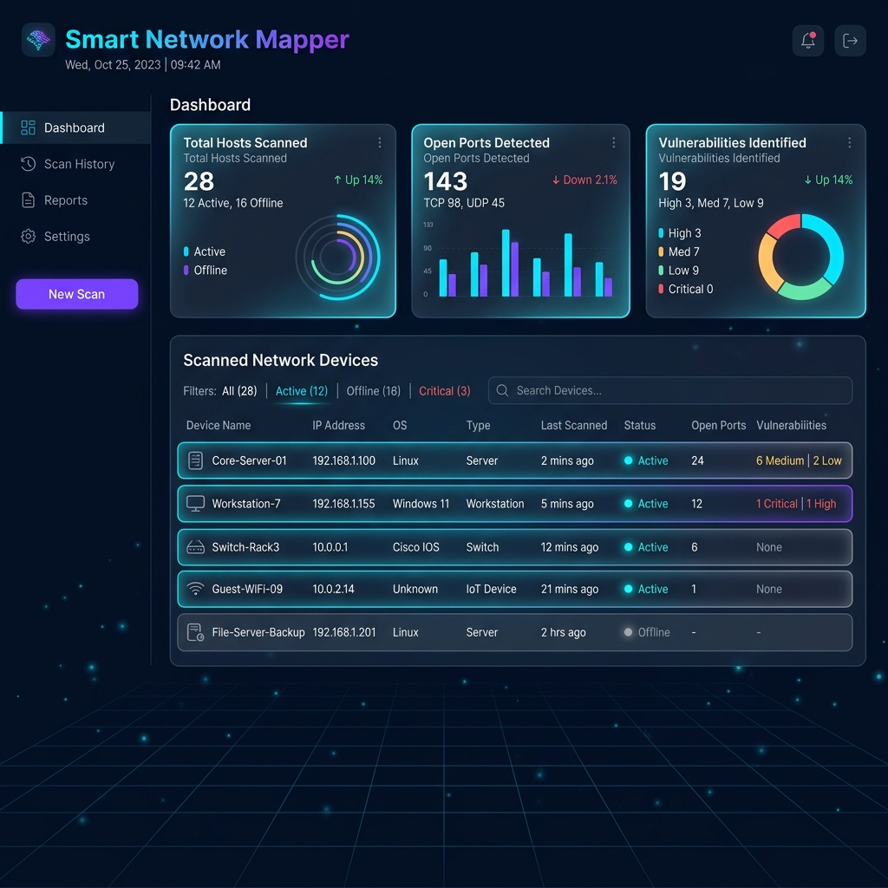
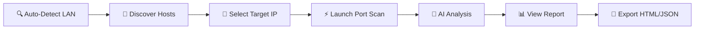

<div align="center">

# 🛰️ Smart Network Mapper

### _Next-Generation Network Diagnostic & AI-Powered Security Suite_

<p>
  
  
  
  
</p>

<p>
  
  
  
  
</p>

<br/>

**A premium cyberpunk-styled network scanner combining industrial-grade analysis with an immersive user interface.**

<br/>

[Features](#-key-features) •
[Installation](#%EF%B8%8F-installation) •
[Usage](#-usage) •
[Architecture](#%EF%B8%8F-project-architecture) •
[AI Engine](#-ai-engine) •
[License](#-license)

<br/>



</div>

---

## 🌟 Why Smart Network Mapper?

> _"Pas un simple scanner. Une suite de diagnostic réseau complète, alimentée par l'intelligence artificielle."_

**Smart Network Mapper (SNM)** combine la **puissance d'analyse** des outils professionnels de cybersécurité avec une **expérience utilisateur moderne** et une **intelligence prédictive** capable d'évaluer en temps réel le niveau de menace de chaque service détecté sur votre réseau.

<table>
<tr>
<td width="50%">

### 🎯 Pour qui ?

- 🔐 **Pentesters** & auditeurs de sécurité
- 👨‍💻 **Administrateurs** réseau
- 🎓 **Étudiants** en cybersécurité
- 🛡️ **Professionnels IT** soucieux de leur infrastructure

</td>
<td width="50%">

### ⚡ Pourquoi ?

- 🚀 Scan **multi-threadé** (200 workers)
- 🧠 IA prédictive **embarquée**
- 🎨 Interface **cyberpunk premium**
- 📊 Rapports **HTML & JSON** professionnels

</td>
</tr>
</table>

---

## ✨ Key Features

### 🔍 Discovery & Mapping

| Feature                      | Description                                                                            |
| ---------------------------- | -------------------------------------------------------------------------------------- |
| 🌐 **Auto LAN Detection**    | Identification automatique de votre configuration réseau (Wi-Fi/Ethernet) via `psutil` |
| 📡 **Hybrid Host Discovery** | Combine **TCP Ping** (Socket) et **ARP Requests** (Scapy) pour une détection maximale  |
| 🖥️ **OS Fingerprinting**     | Estimation du système d'exploitation par analyse TTL                                   |
| 🏷️ **Device Information**    | Récupération MAC, hostname et métadonnées de chaque appareil                           |

### 🛡️ Security Analysis

| Feature                           | Description                                                                      |
| --------------------------------- | -------------------------------------------------------------------------------- |
| ⚡ **Multi-Mode Scanning**        | Modes **Rapide** (22 ports critiques), **Complet** (1-65535) ou **Personnalisé** |
| 🎯 **Banner Grabbing**            | Sondes spécialisées pour **HTTP, SSH, FTP, MySQL, Redis** et plus                |
| 🔬 **Service Versioning**         | Extraction précise des signatures de services                                    |
| 🧠 **AI Vulnerability Predictor** | Évaluation automatique du risque via **Random Forest**                           |

### 📊 Reporting & Export

| Feature                    | Description                                                |
| -------------------------- | ---------------------------------------------------------- |
| 🎨 **Premium HTML Report** | Design responsive avec graphiques SVG cyberpunk            |
| 📦 **JSON Export**         | Données structurées prêtes pour intégration                |
| 📈 **Real-Time Dashboard** | Visualisation live du score de sécurité et ports critiques |

---

## 🛠️ Installation

### 📋 Prerequisites

<table>
<tr>
<td>

**🐍 Python**

- Version **3.8+** requise
- pip à jour recommandé

</td>
<td>

**🔐 Privileges**

- **Admin/Root** requis pour ARP scan
- Mode utilisateur : fonctions limitées

</td>
<td>

**📡 Network Library**

- **Windows** : [Npcap](https://npcap.com/) requis
- **Linux/Mac** : libpcap natif

</td>
</tr>
</table>

### 🚀 Quick Setup

**1️⃣ Cloner le dépôt**

```bash
git clone https://github.com/Amine-NAHLI/smart-network-mapper.git
cd smart-network-mapper
```

**2️⃣ Créer un environnement virtuel** _(recommandé)_

```bash
# Windows
python -m venv venv
venv\Scripts\activate

# Linux / macOS
python3 -m venv venv
source venv/bin/activate
```

**3️⃣ Installer les dépendances**

```bash
pip install -r requirements.txt
```

**4️⃣ Vérifier l'installation**

```bash
python -c "import scapy, customtkinter, sklearn; print('✅ All systems ready!')"
```

> ⚠️ **Note Windows** : Si vous obtenez une erreur Scapy, installez [Npcap](https://npcap.com/#download) en cochant _"Install Npcap in WinPcap API-compatible Mode"_.

---

## 🚀 Usage

### 🎨 Mode Graphique (GUI) — _Recommandé_

L'interface complète avec dashboard temps réel et visualisations cyberpunk :

```bash
python app.py
```

> 💡 **Lancer en admin** pour débloquer toutes les fonctionnalités ARP/Scapy :
>
> - **Windows** : Clic droit sur le terminal → _Exécuter en tant qu'administrateur_
> - **Linux/Mac** : `sudo python app.py`

### ⚡ Mode Terminal (CLI)

Idéal pour serveurs ou exécutions rapides en ligne de commande :

```bash
python main.py
```

L'interface CLI est **100% interactive** avec menus colorés (Colorama) et barre de progression (tqdm).

### 📖 Workflow Typique



**Exemple en GUI :**

1. Cliquez sur **"Auto Detect"** → identifie votre subnet (ex: `192.168.1.0/24`)
2. Cliquez sur **"Discover Hosts"** → liste les appareils actifs
3. Sélectionnez une **IP cible** dans la liste
4. Cliquez sur **"Launch Scan"** → analyse complète avec IA
5. Consultez l'onglet **"RESULTS"** ou ouvrez le rapport HTML généré

---

## 🏗️ Project Architecture

```
smart-network-mapper/
│
├── 📄 app.py                      # 🎨 GUI Entry Point (CustomTkinter)
├── 📄 main.py                     # ⚡ CLI Entry Point (Interactive)
├── 📄 requirements.txt            # 📦 Python Dependencies
├── 📄 LICENSE                     # 📜 MIT License
│
├── 📁 scanner/                    # 🔬 Core Scanning Engine
│   ├── host_discovery.py          # ├─ Hybrid TCP/ARP host detection
│   ├── port_scanner.py            # ├─ Multi-threaded port scanning
│   ├── device_info.py             # ├─ MAC, hostname, OS fingerprinting
│   └── utils.py                   # └─ LAN auto-detection utilities
│
├── 📁 model/                      # 🧠 AI Vulnerability Engine
│   ├── predictor.py               # ├─ Inference logic (Random Forest)
│   ├── code_training.py           # ├─ Model training script
│   ├── vulnerability_model.pkl    # ├─ Main RF classifier (5.1 GB)
│   ├── quantile_transformer.pkl   # ├─ Version normalization (24 KB)
│   ├── scaler.pkl                 # ├─ Feature scaling (895 B)
│   └── feature_names.pkl          # └─ Dataset columns (1.5 KB)
│
├── 📁 reporter/                   # 📊 Report Generation
│   └── html_generator.py          # └─ Cyberpunk HTML reports
│
├── 📁 assets/                     # 🎨 Visual Resources
│   └── gui_preview.png            # └─ Interface screenshot
│
├── 📁 outputs/                    # 💾 Generated Reports
│   ├── scan_result.json           # ├─ Raw scan data
│   └── report.html                # └─ Formatted HTML report
│
└── 📁 tests/                      # 🧪 Test Suite
    ├── test_host_discovery.py
    ├── test_port_scanner.py
    └── test_model_reliability.py
```

---

## 🧠 AI Engine

Le module `model/` embarque un **pipeline complet de Machine Learning** pour la prédiction de vulnérabilités.

### 🔬 Pipeline Technique

```
┌─────────────┐     ┌─────────────┐     ┌─────────────┐     ┌─────────────┐
│  Service    │ ──▶ │  Quantile   │ ──▶ │   Random    │ ──▶ │   Threat    │
│  Detection  │     │ Transformer │     │   Forest    │     │   Level     │
└─────────────┘     └─────────────┘     └─────────────┘     └─────────────┘
   port + banner    normalize versions   classify risk      🔴 🟠 🟡 🟢
```

### 📦 Composants

| Fichier                    | Taille      | Rôle                                 |
| -------------------------- | ----------- | ------------------------------------ |
| `vulnerability_model.pkl`  | **~5.1 GB** | Classifieur Random Forest principal  |
| `quantile_transformer.pkl` | 24 KB       | Normalisation des numéros de version |
| `scaler.pkl`               | 895 B       | Mise à l'échelle des features        |
| `feature_names.pkl`        | 1.5 KB      | Liste des colonnes du dataset        |

### 🎓 Entraînement

Le modèle a été entraîné sur `dataset_model_normalized.csv`, un dataset contenant des **signatures de services** et leurs **ports associés à des vulnérabilités CVE connues**. Le script d'entraînement `model/code_training.py` est inclus pour réentraîner ou affiner le modèle.

> ⚠️ **Note importante** : Les fichiers `.pkl` (notamment `vulnerability_model.pkl` ~5 GB) ne sont **pas inclus** dans le dépôt Git. Voir la section _Setup_ pour les instructions de téléchargement.

---

## 📦 Dependencies

| Library              | Role                                 |
| -------------------- | ------------------------------------ |
| 🌐 **scapy**         | Manipulation de paquets réseau (ARP) |
| 🖥️ **psutil**        | Détection des interfaces réseau      |
| 🎨 **customtkinter** | Interface graphique cyberpunk        |
| 🌈 **colorama**      | Couleurs terminal (CLI)              |
| 📊 **tqdm**          | Barres de progression                |
| 🐼 **pandas**        | Manipulation de données IA           |
| 🔢 **numpy**         | Calculs numériques                   |
| 💾 **joblib**        | Chargement des modèles `.pkl`        |
| 🧠 **scikit-learn**  | Random Forest Classifier             |
| 🧪 **pytest**        | Framework de tests                   |

---

## 🧪 Testing

Le projet inclut une suite de tests unitaires pour garantir la fiabilité des modules critiques :

```bash
# Lancer tous les tests
pytest tests/

# Avec output verbeux
pytest tests/ -v

# Test spécifique
pytest tests/test_port_scanner.py
```

**Modules testés :**

- ✅ `test_host_discovery.py` — Découverte d'hôtes
- ✅ `test_port_scanner.py` — Scan de ports
- ✅ `test_model_reliability.py` — Fiabilité du modèle IA

---

## ⚙️ Configuration

Les paramètres principaux sont définis directement dans le code :

| Paramètre     | Valeur             | Localisation         |
| ------------- | ------------------ | -------------------- |
| `FAST_PORTS`  | 22 ports critiques | `app.py` / `main.py` |
| `max_workers` | 200 threads        | Scanner config       |
| `TIMEOUT`     | 1.5s — 2.5s        | Socket operations    |

---

## 🗺️ Roadmap

- [ ] 🐳 **Docker support** pour déploiement simplifié
- [ ] 🌍 **Support IPv6** complet
- [ ] 📱 **Version web** (Flask/FastAPI)
- [ ] 🔌 **Système de plugins** extensible
- [ ] 📊 **Export PDF** des rapports
- [ ] 🌐 **Internationalisation** (EN/FR/ES)
- [ ] 🤖 **Intégration CVE database** en temps réel
- [ ] ☁️ **Hébergement modèle IA** (Hugging Face)

---

## 🤝 Contributing

Les contributions sont **les bienvenues** ! Voici comment participer :

1. 🍴 **Fork** le projet
2. 🌿 Créez votre branche feature (`git checkout -b feature/AmazingFeature`)
3. 💾 Committez vos changements (`git commit -m 'Add some AmazingFeature'`)
4. 📤 Push vers la branche (`git push origin feature/AmazingFeature`)
5. 🎉 Ouvrez une **Pull Request**

---

## ⚠️ Legal Disclaimer

> **🚨 USAGE RESPONSABLE OBLIGATOIRE 🚨**
>
> Cet outil est conçu **exclusivement** à des fins :
>
> - 🎓 Pédagogiques et éducatives
> - 🔐 D'audit de sécurité **autorisé**
> - 🛡️ De diagnostic sur **vos propres réseaux**
>
> **L'utilisation de cet outil sur des réseaux sans autorisation explicite est ILLÉGALE** et peut être passible de poursuites pénales selon les législations en vigueur (Loi Godfrain en France, CFAA aux USA, etc.).
>
> **L'auteur décline toute responsabilité en cas d'usage malveillant ou non autorisé.**

---

## 📜 License

Ce projet est distribué sous **Licence MIT**. Voir le fichier [`LICENSE`](LICENSE) pour plus de détails.

```
MIT License — Copyright (c) 2026 Amine Nahli
```

---

<div align="center">

## 👨‍💻 Author

### **Amine Nahli**

_Cybersecurity Enthusiast & AI Developer_

<p>
  <a href="https://github.com/Amine-NAHLI">
    
  </a>
</p>

<br/>

### ⭐ Si ce projet vous a plu, laissez une étoile sur GitHub ! ⭐

<br/>

**Made with ❤️ and ☕ by Amine Nahli**

_March 2026 — Smart Network Mapper Project_

</div>
