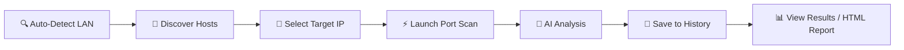

<div align="center">

# 🛰️ Smart Network Mapper

### _Next-Generation Network Diagnostic & AI-Powered Security Suite_

<p>
  
  
  
  
  
</p>

<p>
  
  
  
  
  
</p>

<br/>

**A premium cyberpunk-styled network scanner combining industrial-grade analysis with an immersive user interface and AI-powered vulnerability prediction.**

<br/>

[Features](#-key-features) •
[Architecture](#%EF%B8%8F-project-architecture) •
[Installation](#%EF%B8%8F-installation) •
[Usage](#-usage) •
[AI Engine](#-ai-engine) •
[Build & Deploy](#-build--deploy) •
[License](#-license)

<br/>

</div>

---

## 🌟 Why Smart Network Mapper?

> _"Not just a scanner. A complete network diagnostic suite, powered by artificial intelligence."_

**Smart Network Mapper (SNM)** combines the **analysis power** of professional cybersecurity tools with a **modern user experience** and **predictive intelligence** capable of evaluating in real-time the threat level of each service detected on your network.

<table>
<tr>
<td width="50%">

### 🎯 Who is it for?

- 🔐 **Pentesters** & security auditors
- 👨‍💻 **Network administrators**
- 🎓 **Cybersecurity students**
- 🛡️ **IT professionals** concerned about their infrastructure

</td>
<td width="50%">

### ⚡ Why choose SNM?

- 🚀 **Multi-threaded** scanning (up to 300 workers)
- 🧠 **Embedded** AI vulnerability prediction
- 🎨 **Cyberpunk premium** interface
- 📊 Professional **HTML & JSON** reports
- 💾 **Persistent scan history** (SQLite)
- 📦 **Portable Windows EXE** (no install needed)

</td>
</tr>
</table>

---

## ✨ Key Features

### 🔍 Discovery & Mapping

| Feature                      | Description                                                                       |
| ---------------------------- | --------------------------------------------------------------------------------- |
| 🌐 **Auto LAN Detection**    | Automatic identification of your network config (Wi-Fi/Ethernet) via `psutil`     |
| 📡 **Hybrid Host Discovery** | Combines **TCP Ping** (Socket) and **ARP Requests** (Scapy) for maximum detection |
| 🖥️ **OS Fingerprinting**     | OS estimation via TTL analysis                                                    |
| 🏷️ **Device Information**    | MAC address, hostname & metadata retrieval for each device                        |

### 🛡️ Security Analysis

| Feature                           | Description                                                          |
| --------------------------------- | -------------------------------------------------------------------- |
| ⚡ **Multi-Mode Scanning**        | **Fast** (22 critical ports), **Full** (1-65535) or **Custom** modes |
| 🎯 **Banner Grabbing**            | Specialized probes for **HTTP, SSH, FTP, MySQL, Redis** and more     |
| 🔬 **Service Versioning**         | Precise service signature extraction                                 |
| 🧠 **AI Vulnerability Predictor** | Automatic risk evaluation via **Random Forest** classifier           |

### 📊 Reporting, Export & History

| Feature                    | Description                                                         |
| -------------------------- | ------------------------------------------------------------------- |
| 🎨 **Premium HTML Report** | Responsive design with cyberpunk SVG charts                         |
| 📦 **JSON Export**         | Structured data ready for integration                               |
| 📈 **Real-Time Dashboard** | Live visualization of security score and critical ports             |
| 💾 **SQLite Scan History** | All scans are saved locally; reload, compare or delete past results |

---

## 🏗️ Project Architecture

```
smart-network-mapper/
│
├── 📄 app.py                          # 🎨 GUI Orchestrator (~200 lines)
├── 📄 launcher.py                     # 🚀 Entry point (model check → app or downloader)
├── 📄 snm_paths.py                    # 📍 Cross-platform path management
├── 📄 requirements.txt                # 📦 Python dependencies
├── 📄 LICENSE                         # 📜 MIT License
│
├── 📁 gui/                            # 🖥️ Modular GUI Package
│   ├── constants.py                   # ├─ Design-system tokens (colors, fonts, ports)
│   ├── db.py                          # ├─ SQLite database manager (scan history)
│   └── 📁 pages/                      # └─ Individual page modules
│       ├── dashboard.py               #     ├─ Overview: stats cards, pie chart
│       ├── new_scan.py                #     ├─ Scan config, host discovery, port scan
│       ├── results.py                 #     ├─ Detailed results table with search/filter
│       ├── history.py                 #     ├─ Persistent scan history (SQLite)
│       └── about.py                   #     └─ Animated cyberpunk about page
│
├── 📁 scanner/                        # 🔬 Core Scanning Engine
│   ├── host_discovery.py              # ├─ Hybrid TCP/ARP host detection
│   ├── port_scanner.py                # ├─ Multi-threaded port scanning
│   ├── device_info.py                 # ├─ MAC, hostname, OS fingerprinting
│   └── utils.py                       # └─ LAN auto-detection utilities
│
├── 📁 model/                          # 🧠 AI Vulnerability Engine
│   ├── predictor.py                   # ├─ Inference pipeline (Random Forest)
│   ├── model_download.py              # ├─ Hugging Face model fetcher
│   ├── model_downloader_gui.py        # ├─ GUI for first-launch model download
│   ├── download_models.py             # ├─ CLI model download script
│   ├── vulnerability_model.pkl        # ├─ Main RF classifier (~5.1 GB)
│   ├── quantile_transformer.pkl       # ├─ Version normalization (24 KB)
│   ├── scaler.pkl                     # ├─ Feature scaling (895 B)
│   └── feature_names.pkl              # └─ Dataset column names (1.5 KB)
│
├── 📁 reporter/                       # 📊 Report Generation
│   └── html_generator.py              # └─ Premium cyberpunk HTML reports
│
├── 📁 build_tools/                    # 🔧 Build & Release Pipeline
│   ├── build.bat                      # ├─ PyInstaller compilation script
│   ├── build.spec                     # ├─ PyInstaller spec file
│   ├── package_release.bat            # ├─ Portable package creator
│   ├── upload_windows_release.py      # ├─ Hugging Face ZIP uploader
│   └── pyi_rth_snm_stdio.py          # └─ PyInstaller runtime hook
│
├── 📁 cli/                            # ⌨️ Command-Line Interface
│   └── main.py                        # └─ Interactive CLI scanner (colorama + tqdm)
│
├── 📁 assets/                         # 🎨 Visual Resources
├── 📁 outputs/                        # 💾 Generated Reports & SQLite DB
│   ├── scan_result.json               # ├─ Latest scan data
│   ├── report.html                    # ├─ Latest HTML report
│   └── history.db                     # └─ SQLite scan history database
│
└── 📁 tests/                          # 🧪 Test Suite
    ├── test_host_discovery.py
    ├── test_port_scanner.py
    └── test_model_reliability.py
```

---

## 🛠️ Installation

### 📋 Prerequisites

<table>
<tr>
<td>

**🐍 Python**

- Version **3.8+** required
- pip up-to-date recommended

</td>
<td>

**🔐 Privileges**

- **Admin/Root** required for ARP scan
- User mode: limited features

</td>
<td>

**📡 Network Library**

- **Windows** : [Npcap](https://npcap.com/) required
- **Linux/Mac** : native libpcap

</td>
</tr>
</table>

### 🚀 Quick Setup (From Source)

```bash
# 1. Clone the repository
git clone https://github.com/Amine-NAHLI/smart-network-mapper.git
cd smart-network-mapper

# 2. Create a virtual environment (recommended)
python -m venv .venv
.venv\Scripts\activate        # Windows
# source .venv/bin/activate   # Linux/macOS

# 3. Install dependencies
pip install -r requirements.txt

# 4. Download AI models (~5.1 GB from Hugging Face)
python model\download_models.py

# 5. Verify installation
python -c "import scapy, customtkinter, sklearn, huggingface_hub; print('✅ All systems ready!')"
```

### 📦 Portable Windows Installer (No Python Required)

Download the pre-built portable version from our documentation site:

1. Download `SNM_Windows_Portable_Complet.zip` from [the documentation](https://amine-nahli.github.io/snm-docs/)
2. Extract the ZIP
3. Run `SNM.exe` (accept the UAC admin prompt)

> ⚠️ **Windows Note**: If you get a Scapy error, install [Npcap](https://npcap.com/#download) and check _"Install Npcap in WinPcap API-compatible Mode"_.

---

## 🚀 Usage

### 🎨 Graphical Mode (GUI) — _Recommended_

The full interface with real-time dashboard and cyberpunk visualizations:

```bash
python app.py
```

> 💡 **Run as admin** to unlock all ARP/Scapy features:
>
> - **Windows**: Right-click terminal → _Run as Administrator_
> - **Linux/Mac**: `sudo python app.py`

### ⚡ Terminal Mode (CLI)

Ideal for servers or quick command-line scans:

```bash
python cli\main.py
```

The CLI is **100% interactive** with colored menus (Colorama) and progress bars (tqdm).

### 📖 Typical Workflow



**GUI Steps:**

1. Click **"Auto Detect"** → identifies your subnet (e.g. `192.168.1.0/24`)
2. Click **"Discover Hosts"** → lists active devices
3. Select a **target IP** from the list
4. Click **"Launch Scan"** → full analysis with AI prediction
5. Results are **automatically saved** to SQLite history
6. Check **"RESULTS"** tab or open the generated HTML report
7. Revisit past scans anytime via the **"HISTORY"** tab

---

## 🧠 AI Engine

The `model/` module embeds a **complete Machine Learning pipeline** for vulnerability prediction.

### 🔬 Technical Pipeline

```
┌─────────────┐     ┌─────────────┐     ┌─────────────┐     ┌─────────────┐
│  Service    │ ──▶ │  Quantile   │ ──▶ │   Random    │ ──▶ │   Threat    │
│  Detection  │     │ Transformer │     │   Forest    │     │   Level     │
└─────────────┘     └─────────────┘     └─────────────┘     └─────────────┘
   port + banner    normalize versions   classify risk      🔴 🟠 🟡 🟢
```

### 📦 Model Components

| File                       | Size        | Role                           |
| -------------------------- | ----------- | ------------------------------ |
| `vulnerability_model.pkl`  | **~5.1 GB** | Main Random Forest classifier  |
| `quantile_transformer.pkl` | 24 KB       | Version number normalization   |
| `scaler.pkl`               | 895 B       | Feature scaling (RobustScaler) |
| `feature_names.pkl`        | 1.5 KB      | Dataset column names           |

> 💡 Models are hosted on [Hugging Face](https://huggingface.co/aminenahli/smart-network-mapper-models) and downloaded automatically on first launch.

---

## 🔧 Build & Deploy

All build and release tools are located in the `build_tools/` directory.

### Compile the Executable

```cmd
.\build_tools\build.bat
```

### Package the Portable Release (with AI Models)

```cmd
.\build_tools\package_release.bat
```

### Compress to ZIP & Upload to Hugging Face

```cmd
cd release
tar -a -c -f SNM_Windows_Portable_Complet.zip SNM_Windows_Portable
cd ..
.venv\Scripts\python.exe build_tools\upload_windows_release.py
```

### Build & Deploy the Documentation Site

```cmd
cd ..\snm-docs
npm run build
npm run deploy
```

---

## 📦 Dependencies

| Library                | Role                              |
| ---------------------- | --------------------------------- |
| 🌐 **scapy**           | Network packet manipulation (ARP) |
| 🖥️ **psutil**          | Network interface detection       |
| 🎨 **customtkinter**   | Cyberpunk GUI framework           |
| 🌈 **colorama**        | Terminal colors (CLI)             |
| 📊 **tqdm**            | Progress bars                     |
| 🐼 **pandas**          | AI data manipulation              |
| 🔢 **numpy**           | Numerical computations            |
| 💾 **joblib**          | Loading `.pkl` model files        |
| 🧠 **scikit-learn**    | Random Forest Classifier          |
| 🤗 **huggingface_hub** | AI model download                 |
| 🧪 **pytest**          | Test framework                    |

---

## 🧪 Testing

```bash
# Run all tests
pytest tests/

# Verbose output
pytest tests/ -v

# Specific test
pytest tests/test_port_scanner.py
```

**Tested modules:**

- ✅ `test_host_discovery.py` — Host discovery
- ✅ `test_port_scanner.py` — Port scanning
- ✅ `test_model_reliability.py` — AI model reliability

---

## ⚠️ Legal Disclaimer

> **🚨 RESPONSIBLE USE REQUIRED 🚨**
>
> This tool is designed **exclusively** for:
>
> - 🎓 Educational and pedagogical purposes
> - 🔐 **Authorized** security audits
> - 🛡️ Diagnostics on **your own networks**
>
> **Using this tool on networks without explicit authorization is ILLEGAL** and may be subject to criminal prosecution under applicable laws.
>
> **The author declines all responsibility for malicious or unauthorized use.**

---

## 📜 License

This project is distributed under the **MIT License**. See the [`LICENSE`](LICENSE) file for details.

```
MIT License — Copyright (c) 2026 Amine Nahli
```

---

<div align="center">

## 👨‍💻 Author

### **Amine Nahli**

_Cybersecurity Enthusiast & AI Developer_

<p>
  <a href="https://github.com/Amine-NAHLI">
    
  </a>
</p>

<br/>

### ⭐ If you liked this project, leave a star on GitHub! ⭐

<br/>

_June 2026 — Smart Network Mapper v1.0_

</div>
